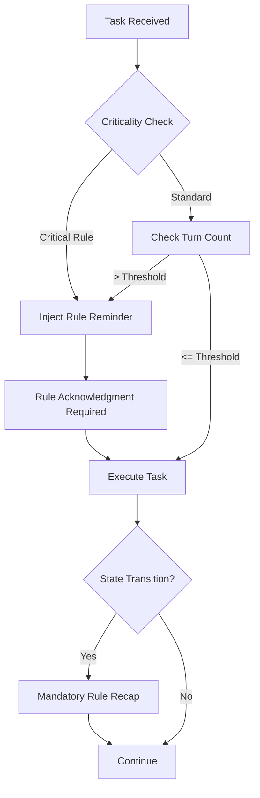

# Phase 8: Context Persistence & Memory Decay Analysis

## 1. Understanding & Analysis

### 1.1 Core Problem Statement

用戶指出了一個關鍵問題：

> "如果原先記得，隨後因為上下文壓縮或注意力丟失而忘記呢"

這揭示了當前方案的**根本性缺陷**：

-   我們設計的所有規則（語言政策、反幻覺協議）都依賴於 AI 在**長對話中持續記住這些規則**
-   但 LLM 在長對話中會經歷：
    1. **Context Window Saturation**：上下文窗口填滿後，早期指令被壓縮或丟棄
    2. **Attention Decay**：隨著對話深入，對早期指令的注意力權重下降
    3. **Instruction Forgetting**：在複雜任務中，特定規則可能被「遺忘」
    4. **Priority Inversion**：新的用戶指令可能覆蓋原有的系統規則

### 1.2 Current Protocol Vulnerability Assessment

分析現有 Cortex Protocol 的記憶持久性：

| 機制                     | 位置        | 持久性評級 | 衰減風險                                   |
| ------------------------ | ----------- | ---------- | ------------------------------------------ |
| State Reporting Protocol | Section 3.4 | **LOW**    | 在 50+ 輪對話後容易被忘記                  |
| Language Policy (提案)   | Section 7   | **LOW**    | 容易被用戶語言偏好覆蓋                     |
| Anti-Hallucination Rules | Section 8   | **MEDIUM** | 在複雜任務中可能降級為「建議」而非「強制」 |
| Evidentiary Protocol     | Section 6   | **MEDIUM** | 在快速執行模式(L1/M1)中容易被跳過          |
| Quality Gates            | Section 5   | **HIGH**   | 因為有具體檢查點，較不易忘記               |

**結論**：當前協議是**被動式（Passive）**的，依賴 AI 的自律來遵守規則。

### 1.3 User's Insight: Dynamic Reinforcement System

用戶建議的核心要素：

1. **強迫性（Mandatory）**：不是「建議」而是「必須」
2. **頻率適當（Frequency-Optimized）**：不能太頻繁（浪費 tokens）或太稀疏（失效）
3. **重要性驅動（Importance-Driven）**：根據規則的關鍵性調整提醒頻率
4. **系統級設計（Systemic）**：整合到架構中，而非附加規則

## 2. Deep Dive: Context Persistence Mechanisms

### 2.1 LLM Memory Architecture Analysis

LLM 的記憶特性：

```
┌─────────────────────────────────────────────┐
│  System Prompt (Highest Priority)          │ ← 最不易被忘記
├─────────────────────────────────────────────┤
│  Recent Messages (Recency Bias)            │ ← 高注意力權重
├─────────────────────────────────────────────┤
│  Task Context (Active Working Memory)      │ ← 中等注意力
├─────────────────────────────────────────────┤
│  Early Instructions (Decay Zone)           │ ← **衰減風險區**
├─────────────────────────────────────────────┤
│  Compressed/Summarized Context             │ ← 資訊損失
└─────────────────────────────────────────────┘
```

### 2.2 Existing Industry Solutions

#### 2.2.1 Anthropic's Constitutional AI Approach

-   **機制**：在系統提示中嵌入「憲法原則」
-   **強化**：每個回應前內部執行「自我批評循環」
-   **局限**：依賴模型訓練，無法後天修改

#### 2.2.2 OpenAI's Function Calling Constraints

-   **機制**：強制 AI 在每次回應中選擇工具調用
-   **強化**：通過結構化輸出格式強制遵守
-   **啟示**：**結構化約束比自然語言指令更可靠**

#### 2.2.3 Microsoft's Guidance Library

-   **機制**：使用正則表達式和模板限制輸出
-   **強化**：在生成階段即時驗證
-   **啟示**：**生成時驗證優於生成後檢查**

#### 2.2.4 LangChain's Memory Systems

-   **機制**：外部向量數據庫儲存記憶
-   **強化**：每輪對話前注入相關記憶
-   **啟示**：**外部化記憶可規避上下文限制**

### 2.3 Proposed Solution Architecture: Active Reinforcement System

基於以上分析，提出**主動式強化系統（Active Reinforcement System, ARS）**：



#### 核心設計原則：

**1. Rule Hierarchy & Injection Frequency**

將規則分為三個等級：

| 等級             | 規則類型   | 注入頻率                  | 範例                         |
| ---------------- | ---------- | ------------------------- | ---------------------------- |
| **P0: Critical** | 零容忍規則 | 每 5 輪對話或每次狀態轉換 | 語言政策、工具確認、證據呈現 |
| **P1: High**     | 品質門檻   | 每 10 輪對話或特定狀態    | 測試覆蓋、程式碼規範         |
| **P2: Medium**   | 最佳實踐   | 每 20 輪對話或用戶請求    | 設計原則、註釋風格           |

**2. State-Triggered Reinforcement**

在特定 TESM 狀態轉換時，自動注入相關規則：

```
IDLE → ANALYZING: 注入 [Language Policy, Context Foundation Rules]
ANALYZING → PLANNING: 注入 [Anti-Hallucination Rules, Test Requirements]
PLANNING → EXECUTING: 注入 [Tool Confirmation, Error Handling]
EXECUTING → VERIFYING: 注入 [Evidentiary Protocol, Quality Gates]
VERIFYING → DELIVERING: 注入 [Documentation Standards, State Reporting]
```

**3. Acknowledgment-Based Validation**

在注入關鍵規則後，要求 AI **明確確認**：

```
[RULE INJECTION]
Critical Rule: All code, comments, and commit messages MUST be in English.
Exception: User-facing strings or when explicitly instructed otherwise.

Required Response Format:
✓ [ACKNOWLEDGED] I will enforce English-only coding standards in this task.
```

**4. Structured Output Enforcement**

將關鍵規則轉換為**強制輸出格式**：

當前（弱約束）：

```
"Every AI response MUST begin with a status line..."
```

重構後（強約束）：

```yaml
response_schema:
    required:
        - state_header: '[STATE: <state> | POLICY: <policy>]'
        - language_declaration: '[LANG: Communication=<lang> | Coding=en]'
        - confidence_level: '[CONFIDENCE: <level>]' # for claims
        - body: '<content>'
```

### 2.4 Implementation Strategy: Protocol Restructuring

#### 2.4.1 從「說明文檔」到「執行引擎」

**當前架構問題**：

-   Cortex Protocol 是一份「說明文件」，期待 AI 自行遵守
-   沒有強制機制，全靠 AI 的「自律」

**重構方向**：將協議轉換為**可執行的狀態機規範**：

```
# 當前結構
Section 1: Core Principles (描述性)
Section 2: Persistent Intelligence Core (抽象)
Section 3: Task Execution State Machine (半結構化)

# 重構後結構
Section 0: Execution Framework (執行引擎定義)
  ├─ 0.1 Response Schema (強制輸出格式)
  ├─ 0.2 Rule Injection Points (規則注入點)
  └─ 0.3 Validation Mechanisms (驗證機制)

Section 1: Critical Rules (P0) (可注入規則)
Section 2: High-Priority Rules (P1)
Section 3: Best Practice Guidelines (P2)
Section 4: State Machine (with embedded triggers)
```

#### 2.4.2 Role Definition Restructuring

**當前問題**：每個 Mode 的 `customInstructions` 都是長文本，容易被壓縮

**重構方向**：

```yaml
mode:
    slug: code
    name: 🖥️ Code

    #
```
