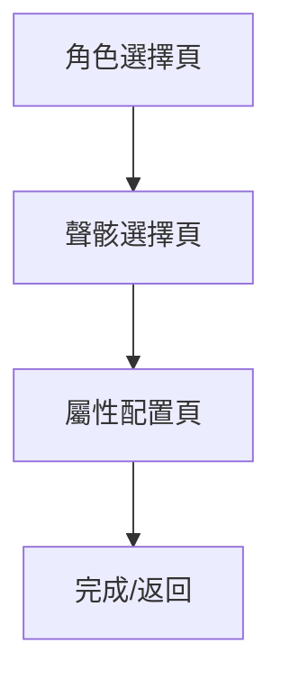

# WUWA Echos UI Redesign Plan v1.0.0-1

## 專案概述
重新設計 WUWA Echos 配置器的 UI，包含角色卡片展示、聲骸選擇流程、屬性配置介面。

## 現有資源分析

### 資料結構
- **resonators.json**: 角色資料，包含 Name, Attribute, WeaponType, Rarity, Icon 等
- **echoes.json**: 聲骸資料，包含 Name, Class, Cost, SonataGroup, Icon 等
- **growth_table.json**: 副屬性數值表

### 圖片資源
- **card.png**: 120x160 卡片背景 (3:4 比例)
- **角色圖片**: 240x320 (3:4 比例，如 18903.png)
- **聲骸圖片**: 1:1 比例
- **Icon 圖片**: 屬性、武器、稀有度等圖標

## 設計規格

### 1. 角色卡片 (Character Card)

**尺寸**: 120x160px (3:4)

**結構**:
```
┌─────────────────┐
│                 │
│   角色圖片       │  <- 置中裁切顯示
│   (3:4)         │
│                 │
├─────────────────┤
│ ★★★★★        │  <- 稀有度圖示 (RarityIcon)
├─────────────────┤
│    角色名        │  <- 名稱文字
└─────────────────┘
```

**實現方式**:
- 使用 `img/card.png` 作為卡片背景
- 角色圖片使用 `object-fit: cover` 置中裁切顯示
- 稀有度使用 `RarityIcon` 欄位的圖片 (img/00210.png 為五星)
- 卡片下方顯示角色名稱

### 2. 聲骸選擇介面 (Echo Selection)

**布局**: 單一層次，避免過多層次跳換

**結構**:
```
┌─────────────────────────────────────────┐
│  聲骸配置                    COST: 8/12  │
├─────────────────────────────────────────┤
│  [全部] [COST1] [COST3] [COST4]         │  <- 標籤過濾
├─────────────────────────────────────────┤
│  ┌────┐ ┌────┐ ┌────┐ ┌────┐          │
│  │圖片│ │圖片│ │圖片│ │圖片│ ...       │  <- 聲骸圖片網格
│  │COST│ │COST│ │COST│ │COST│            │
│  └────┘ └────┘ └────┘ └────┘          │
├─────────────────────────────────────────┤
│  已選擇: ○ ○ ○ ○ ○                      │  <- 5個圓圈空位
│           ↑                              │
│         主位聲骸 (左一)                   │
├─────────────────────────────────────────┤
│         [  下一步: 配置屬性  ]           │
└─────────────────────────────────────────┘
```

**功能**:
- 標籤過濾: 全部 / COST1 / COST3 / COST4
- 實時計算 COST 消耗，超過 12 時調暗並拒絕選取
- 點擊聲骸依序填入下方 5 個圓圈 (左一為主位)
- 懸浮提示: 展開圖片 + 名字 + COST 值

### 3. 聲骸屬性配置頁面 (Echo Stats Configuration)

**布局**: 5 個聲骸列，每列獨立配置

**單列結構**:
```
┌─────────────────────────────────────────────────────────────────┐
│ ┌─────┐ ┌───┐ ┌────┐ ┌────┐ ┌────┐ ┌────┐ ┌────┐ ┌────┐       │
│ │聲骸 │ │COST│ │主屬│ │副屬1│ │副屬2│ │副屬3│ │副屬4│ │副屬5│       │
│ │圖示 │ │數值│ │性  │ │     │ │     │ │     │ │     │ │     │       │
│ │     │ ├───┤ └────┘ └────┘ └────┘ └────┘ └────┘ └────┘       │
│ │     │ │套裝│                                                   │
│ │     │ │圖示│                                                   │
│ └─────┘ └───┘ ┌──────────────────┐ ┌──────────────────┐        │
│               │ 屬性類型選單      │ │ 屬性數值選單      │        │
│               │ [暴擊率 ▼]       │ │ [10.5% ▼]        │        │
│               └──────────────────┘ └──────────────────┘        │
└─────────────────────────────────────────────────────────────────┘
```

**互動邏輯**:
- 6 個按鈕: 1 個主屬性 + 5 個副屬性
- 每個按鈕下方有兩個長條選單: 屬性類型 + 屬性數值
- 每次只允許選擇一個按鈕
- 填寫完成兩選單後自動步進到下一個按鈕
- 聲骸與按鈕之間有豎排: COST 值 + 合鳴套裝圖示

### 4. 圖片比例處理

**角色圖片 (3:4)**:
- 原始尺寸: 240x320
- 顯示尺寸: 120x160
- CSS: `object-fit: cover; object-position: center;`

**聲骸圖片 (1:1)**:
- 顯示尺寸: 64x64 (選擇介面) / 48x48 (配置頁面)
- CSS: `object-fit: contain;`

### 5. Icon 替換文字

**稀有度**:
- 五星: `img/00210.png`
- 四星: `img/00211.png`

**屬性**:
- 氣動: `img/00213.png`
- 導電: `img/00214.png`
- 冷凝: `img/00215.png`
- 熱熔: `img/00216.png`
- 衍射: `img/00217.png`
- 湮滅: `img/00218.png`

**武器**:
- 長刃: `img/00528.png`
- 臂鎧: `img/00529.png`
- 迅刀: `img/00530.png`
- 佩槍: `img/00531.png`
- 音感儀: `img/00532.png`

## 技術實現

### 頁面流程


### 狀態管理
```javascript
state = {
    lang: "TC",
    resonators: {},
    echoes: {},
    selectedChar: null,
    selectedEchoes: [
        { id: null, mainStat: null, subStats: [] },
        { id: null, mainStat: null, subStats: [] },
        { id: null, mainStat: null, subStats: [] },
        { id: null, mainStat: null, subStats: [] },
        { id: null, mainStat: null, subStats: [] }
    ],
    currentPage: "char-select" // char-select | echo-select | echo-stats
}
```

### CSS 變數
```css
:root {
    --card-width: 120px;
    --card-height: 160px;
    --echo-thumb-size: 64px;
    --echo-config-size: 48px;
    --cost-filter-active: #00ffcc;
    --cost-filter-disabled: #444;
}
```

## 檔案結構

```
WUWA Echos/
├── index.html          # 更新後的主頁面
├── css/
│   └── style.css       # 更新後的樣式
├── js/
│   └── app.js          # 更新後的邏輯
├── img/
│   ├── card.png        # 卡片背景
│   └── ...             # 其他圖片
└── plan.md             # 本文件
```

## 實作順序

1. **角色卡片 UI**: 實現 120x160 卡片，堆疊 card.png 和角色圖片
2. **Icon 替換**: 將稀有度、屬性、武器文字替換為圖示
3. **聲骸選擇介面**: 單一層次選擇，COST 標籤，實時計算
4. **聲骸懸浮提示**: 滑鼠懸浮展開資訊
5. **屬性配置頁面**: 主/副屬性配置，自動步進邏輯
6. **整合測試**: 完整流程測試
